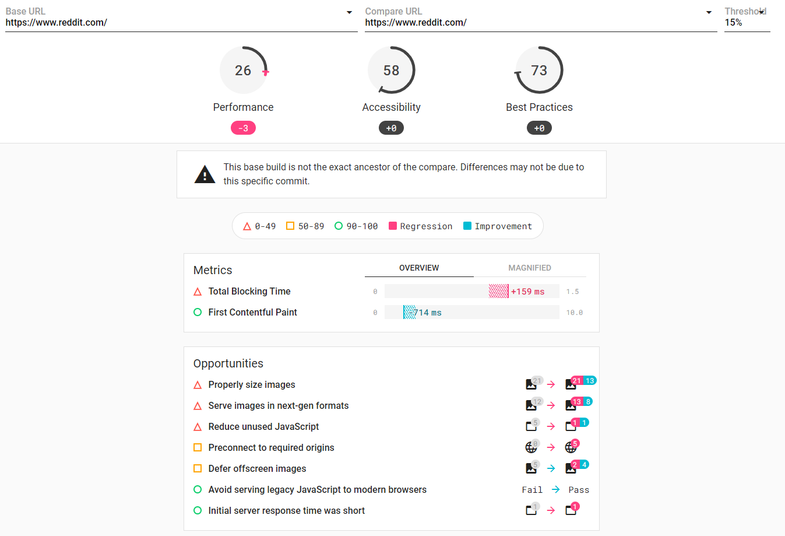
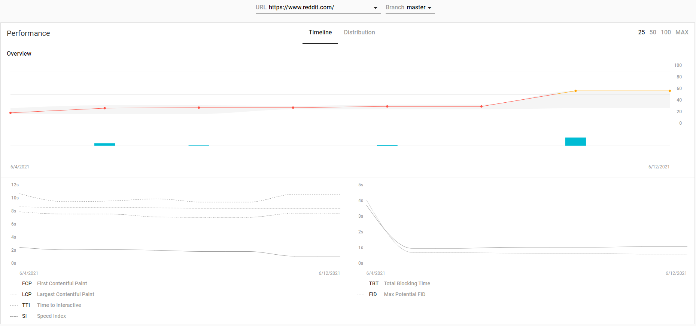
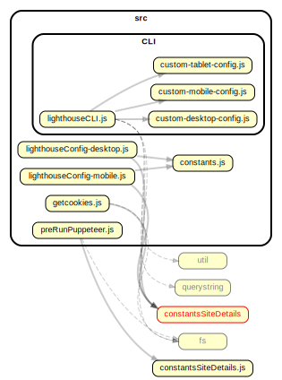

# Lighthouse Automation Toy

## Project Overview
This is a toy created for anyone to use as starting point for their exploration of using Google's Lighthouse-CI for their automated testing. 

It assumes you have a simple list of URLs and only cookie authentication.
Some article links can guide you through more complex setups.

The server setup provides version compares and long term trends.

Commit comparisons:

Long Term Trends:


- [Lighthouse Automation Toy](#lighthouse-automation-toy)
  - [Project Overview](#project-overview)
  - [Installation Instructions](#installation-instructions)
  - [Operating Instructions](#operating-instructions)
  - [Key Files and Modules](#key-files-and-modules)
  - [Dependency Graph](#dependency-graph)
  - [Roadmap](#roadmap)
  - [Common Issues](#common-issues)
  - [Contributing](#contributing)
  - [Relevant Links](#relevant-links)
  - [License](#license)

## Installation Instructions
In command line run NPM Install and ensure all modules install correctly

Create the configuration file "constantsSiteDetails.js"
```javascript
'use strict';

// Variables for sourcing cookies from a site you're already logged into.
// getcookies.js uses this for getting it during COOKIE TIME!
var cookiesource = {
    // fully qualified URL to the page we'll get cookies for from your current browser.
    link : 'https://www.somedomainlogin.com/url/to/page/',
    // fully qualified URL for the login page for which we'll set cookies with puppeteer.
    preRunPuppeteerlink : 'https://www.somedomainlogin.com/url/to/page/',
};
module.exports = {cookiesource};

```

- Update the configuration in the following files
  - `lighthouserc.yml` this is the main configuration with defaults.
    - Update the number of runs required
    - Add URL's to run lighthouse against
    - Check upload/server details for your requirements. 
      - Using the lhci target lets you run things locally...
  - `lighthouseConfigDesktop.js` desktop settings for "collectAll"
  - `lighthouseConfigMobile.js` mobile settings for "collectAll"
  - `preRunPuppeteer.js`
    - Updates required if you're using anything other than cookies.
- Run `COOKIE TIME!` npm script to get cookies from current chrome or create cookie.json manually.
- Run `healthcheck` npm script to confirm all the setup work is completed sensibly.
- Run `collect` npm script to see your first results in `./lighthouseci`
- Run the `start` script or alternatively in command line run `lhci server`
- Go to the local host (listed in lighthouserc.json), e.g http://localhost:9001
  -  At this point you'll get a "welcome to Lighthouse CI message
- Run `lhci wizard`

## Operating Instructions

## Key Files and Modules
    .
    ├── constants.js                  # constants script from google for, reasons.
    ├── constantsSiteDetails.js       # URLs for getcookies.    
    ├── cookie.json                   # Cookie... probably not tracked on git.
    ├── lighthouserc.yml              # Main setup   
    ├── lighthouseConfig-desktop.js   # Desktop overrides
    ├── lighthouseConfig-mobile.js    # Mobile overrides
    ├── lighthouserc.json
    ├── preRunPuppeteer.js            # Pre-Auth script.
    └── README.md
## Dependency Graph


## Roadmap
- None

## Common Issues
- Ensure all libraries are up to date by running `npm outdated`
- Node-gyp ... 
  - `npm install node-gyp@latest` <-- endless pain...
  - `npm install --global node-gyp@latest` <-- unfortunately yes...
- updates that can solve some lock issues
  - `npm i --save npm-check-updates`
  - `ncu -g`

## Contributing
Let's not get ahead of ourselves here. 
This is a toy.

## Relevant Links
-  [web.dev lighthouse-ci](https://web.dev/lighthouse-ci/)
-  [github lighthouse configuration](https://github.com/GoogleChrome/lighthouse/blob/master/docs/configuration.md)
-  [web.dev lighthouse-ci config](https://github.com/GoogleChrome/lighthouse-ci/blob/main/docs/configuration.md)
-  [gurucharan's blog on lighthouse CI](https://www.gurucharan.in/web/nodejs/lighthouse-ci-the-complete-guide-part-1/)
-  [puppeteer](https://github.com/puppeteer/puppeteer/blob/v2.0.0/docs/api.md#class-browser)
-  [performance budgets intro](https://web.dev/use-lighthouse-for-performance-budgets/)
-  [Available Performance budgets](https://github.com/GoogleChrome/lighthouse/blob/master/docs/performance-budgets.md)

## License
[MIT](https://choosealicense.com/licenses/mit/)